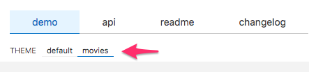

<h1 align="center">
  🧩 Components!
  <br/><br/>
</h1>

<h4 align="center">Creating create the awesome interface and behavior of your application.</h4>

<p align="center">
  <a href="./README.md">🏠 Home</a> •
  <a href="#-introduction">🔥 Introduction</a> •
  <a href="#-getting-started">🚀 Getting started</a> •
  <a href="#-checkpoint">📍 Checkpoint</a>
</p>

## The sui-components & marketplace-components

First of all, before explaining to you how to do it, it's important to know what are the marketplace-components that are created inside the marketplace studio and the sui-components that are created inside the sui-studio. Both of them use the same tool to create them that is the `sui-studio` but we will see it in the next steps.

### The sui-components

The sui-components are a set of **presentational** components that are already created in an effort by the UI & UX & Frontend teams to have the most reusable view logic shared between our marketplaces. You can check the repository [here](https://github.com/SUI-Components/sui-components) and you can see a live demo of the components and studio [here](https://sui-components.now.sh/).

### The marketplace-components

The marketplace components are reusable in the same way as the sui-components are, but they are not involved in the task of being approved by the whole stack of ux & ui & frontend members of all Schibsted Spain. They're the components that only apply to the marketplace itself regarding its design or the feature that implement.

_NOTE: BOTH sui and marketplace components are developed using the same JS and SCSS code quality and linting conventions and use almost the same tooling too. So, if you are able to create a marketplace component you should be able to create a sui as well._

### Creating our marketplace-studio.

To create your studio components, let's create a new folder called components inside your web-app repository.

Once you have that folder we are gonna install some dependecies that we need to have our studio


```
> npm i @s-ui/studio @s-ui/studio-utils @s-ui/js-compiler
```

Now, what we have to do is to add some scripts that are gonna help us to create and develop our components.
In the package.json of your web-app, add the following scripts:

```
    ...
    "studio:dev": "sui-studio dev",
    "studio:generate": "sui-studio generate -P sui -S adv-ui --swc",
    ...
```

And that's it! Now we are ready to create and develop our components

### How we work with our view logic

At Adevinta Spain frontend we separate concerns **literally** as you may imagine in repositories.

**How do we relate our requests to backend, calculations etc...(business logic) with our view logic?**
You will find out in the [lesson 3](https://github.mpi-internal.com/scmspain/frontend-all--pet-project/tree/master/3-frontend-mv--lib-movies). But basically we use an Object called DOMAIN that includes all our **use cases**.

**Your components should not include any requests**

The components that you develop here will retrieve by props all the information that they need so... imagine that you are developing a page component. In our studio you will 'instantiate' it using react in the following way:

```jsx
<MoviesPage moviesList={fakeArray} />
```

We will see that in our web-app projects we inject the initial props through a 'getInitialProps' method so... at this moment try to fake all the data that your components need to abstract them from any business logic.

### Creating our first component.

Creating a component is easy with sui-studio. But first, we need to change something in our package.json:
In the "generate" script change this `-P sui` to your marketplace acronym `--prefix <marketplace acronym>` for example for vibbo our acronym is vb so... `--prefix vb`

Save and then in your web-app folder just run:

```
> npm run studio:generate <category> <component name>
```

For example:

```
> npm run studio:generate header search
```

It will create these files:

```
/components/header/search/src/index.js
/components/header/search/src/index.scss
/demo/header/search/playground
```

**Tip**

In case your component has more than one type of visualization and you would like to add some js code in demo, you could replace:

```
/components/demo/header/search/playground
```

by

```
/components/demo/header/search/demo/
```

- And inside this folder, you could have:
  - index.js
  - package.json

### Developing your component

In order to start developing your first component we are going to use `sui-studio`, running the following command in your web-app folder:

```
npm run studio:dev <category/component>
```

For example:

```
npm run studio:dev header/search
```

This will launch sui-studio in development mode (using `sui-studio dev`) in `localhost:3000` by default, allowing you to develop your component isolated inside the studio you have just created.

_NOTE: An existent component name is mandatory for the studio to start, so if you get an error like `TypeError: Cannot read property 'split' of undefined` it is because the studio is not being able to find the component you specified, check the name/spelling of the component._

### Working with nested components

As soon as you have several components you will probably want to reuse and place them inside another component.

But to do that you will need first to specify what dependencies your components have and also tell `sui-studio` to link them in development mode, so:

1. Add your nested components as dependencies in the current component's `package.json` using the package name and version "1".
   For example, if we would want to use our new `HeaderSearch` component inside another one, we would add the following to the parent component:

```
"dependencies": {
    "@s-ui/component-dependencies": "1",
    "@frontend-mv--uilib-components/mv-header-search": "1",
    ...
    }
```

2. Start again your sui-studio using the `link-all` flag:

```
npm run studio:dev <category/component> --link-all
```

\_NOTE: You can also specify individual packages instead of using the `link-all` option with `link-package`:

```
npm run dev -- <category/component> --link-package=/components/header/search
npm run dev -- <category/component> --link-package=../header/search
```

### Loading `<marketplace>-theme` into the studio

To import out theme into the studio, lets create a new folder called studio

Inside this foler we are gonna create another called themes, and inside that folder create a new file called mv-theme.scss

This should be the structure

```
/
├── studio/
│   └── themes
│   │   └── mv-theme.scss

```
Add the following content to the file we created:

```
@import "~frontend-mv--uilib-theme/lib/index";
```

To see your components, you need to tell sui-studio what you want (let's assume your theme is called `mv-theme`):

- Create the following file
  - /components/demo/header/search/themes/movies.scss

Add the following content to the file we created:

```
@import '../../../../../studio/themes/mv-theme.scss';
@import '../../src/index.scss';
```

And you're done! Now you should see a new theme button appear in the studio UI



### SASS Conventions and linting rules

Our sass variable names are created following the [emmet abrevation syntax](https://docs.emmet.io/cheat-sheet/) and our styling methodology is [SUIT-CSS](http://suitcss.github.io/).

- [sass variables](https://docs.mpi-internal.com/scmspain/frontend-convergence/Sass/Variables/)
- [classNames](http://suitcss.github.io/)

Classname naming runs over the follow convention:

_For root elements_

```jsx
<!-- ROOT ELEMENT -> sui-<ComponentName> in pascal case notation -->
<div className='sui-DummyComponent'>
```

_For first children_

```html
<!-- ROOT ELEMENT -> sui-<ComponentName> in pascal case notation -->
<div className="sui-DummyComponent">
  <!-- FIRST CHILD -> sui-<ComponentName>-<childName> child name
  in camel case notation -->
  <div className="sui-DummyComponent-firstChild"></div>
</div>
```

### Commit and deployment of our component

All the studios are by definition [monorepos](https://trunkbaseddevelopment.com/monorepos/) so... as you may imagine we use sui-mono to handle with commit and release of our packages.

Each component is published as an independent package.

Following the same idea as we've done in the first lesson, we don't recommend to publish to NPM these pet project components.

Instead, go to the components/\<category>/\<mycomponent> folder and run npm link.

Then inside the project where you want to 'install' the component run npm link \<package component name>

If you have any troubles or doubts don't hesitate to talk with your mentor!
